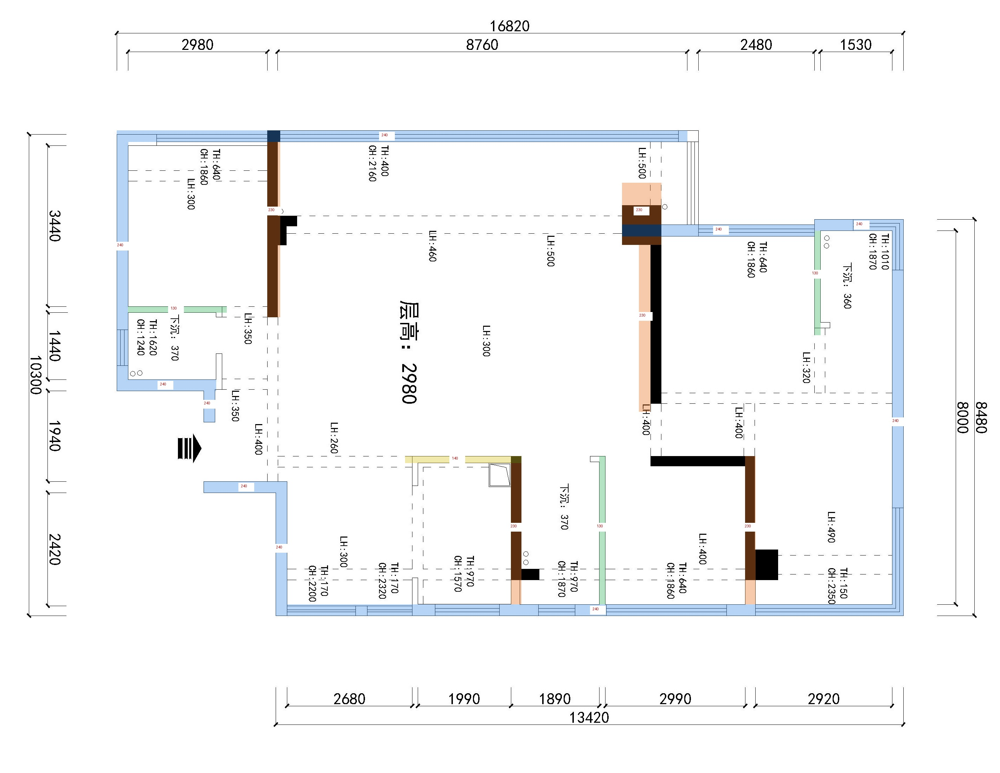
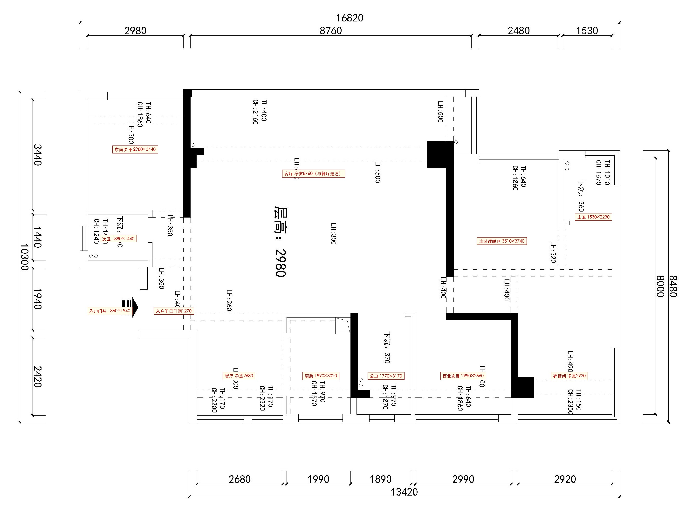

# 全屋尺寸盘点——墙厚 · 墙长 · 房间净尺寸

> 依据图纸：`原始量尺图/户型-量尺-山也_裁剪.jpg`（CAD 矢量导出，2844×2200）
> 方向约定：**图上为南、图下为北、图左为东、图右为西**（阳台/主要采光面在南）
> 整理日期：2026-10-03

---

## 一、基础信息

| 项目 | 数值 | 说明 |
|---|---|---|
| 层高 | **2980 mm** | 图中"层高：2980" |
| 图纸标注建筑面积 | **153 ㎡** | 图中原始标注 |
| 南立面总宽 | **16820 mm** | 东外墙外边 → 西外墙外边 |
| 北墙总长 | **13420 mm** | 餐厅东墙 → 西外墙 |
| 东墙总长 | **10300 mm（外）** | 南→北分段：3440·1440·1940·2420 |
| 西墙总长 | **8480 mm（外）/ 8000 mm（净）** | — |

**量算口径**
- 比例尺：7.519 mm/px（南墙 16820÷2237px；东墙 10300÷1370px 反算 7.518，两者一致，图纸严格等比例）。
- **墙厚、墙长、净尺寸一律取整到 10 mm**（墙厚无个位数，如 241→240）。
- 符号含义：`TH` 窗台高（窗下沿距地）、`CH` 窗顶高（窗上沿距地）、`LH` 梁高标注、`下沉` 卫生间地面下沉高度（同层排水）。

---

## 二、墙厚分类总表

| 墙类型 | 厚度 | 主要位置 |
|---|---|---|
| **外墙** | **240** | 南外墙、北外墙、东外墙、西外墙、凹进段南墙、门斗北墙 |
| **承重/剪力墙** | **230**（局部 220） | 次卧-客厅墙、厨房东/公卫西墙、客厅-主卧 L 型墙、次卧西/衣帽东墙 |
| **厨房南墙** | **140** | 厨房与门厅/餐厅之间（开门） |
| **轻质隔墙** | **130** | 次卧-次卫墙、公卫东墙、主卧-主卫墙 |

---

## 三、竖墙（南北走向）厚度 × 长度

| 编号 | 位置 | 厚度 | 长度 | 备注 |
|---|---|---|---|---|
| V1 | 东外墙（南墙→次卫南墙段） | **240** | **5490** | 含次卧南窗、次卫高窗 |
| V2a | 门斗西墙（南段） | **240** | **700** | 与门厅分隔 |
| V2b | 餐厅东墙 | **240** | **2870** | 门斗北墙以北段 |
| V3 | 东南次卧-客厅承重墙 | **230** | **3990** | 南墙→次卧北墙，实心 |
| V4 | 厨房东墙/公卫西墙（承重） | **230** | **3170** | 实心，含黑色排烟/管井段 |
| V5 | 公卫东墙（隔墙） | **130** | **3170** | 双线墙 |
| V6 | 客厅-主卧 L 型承重墙 | **230**（端柱约 840 宽） | 端柱约 840 + 墙身 **3570** | 端柱为剪力墙方柱，墙身向南/北延伸 |
| V7 | 西北次卧西墙/衣帽间东墙（承重） | **230** | **3170** | 实心 |
| V8 | 主卧-主卫隔墙 | **130** | **2470** | 双线墙，南墙→主卫门洞 |
| V9 | 西外墙 | **240** | **8480** | 内边净长 8000 |

---

## 四、横墙（东西走向）厚度 × 长度

| 编号 | 位置 | 厚度 | 长度 | 备注 |
|---|---|---|---|---|
| H1 | 南外墙（客厅/次卧凸出段） | **240** | **12010**（外）/ 11590（内） | 含次卧南窗、客厅推拉门 |
| H2 | 东南次卧-次卫隔墙 | **130** | **2110**（外）/ 1880（内） | — |
| H3 | 次卫南墙（外墙） | **240** | **1880** | 东外墙→门斗西墙 |
| H4 | 门斗北墙 | **240** | **1780** | 门斗西墙→餐厅东墙 |
| H5 | 厨房南墙 | **140** | **2480**（外）/ 2210（内） | 开门，通向门厅 |
| H6 | 主卧南墙（凹进段） | **240** | **4110** | 东端实心段 + 南窗 2480 |
| H7 | 主卫南墙（凹进段） | **240** | **1900**（外）/ 1530（内） | 含转角窗 |
| H8 | 北外墙 | **240** | **13420** | 含厨房、公卫、次卧、衣帽各窗 |

---

## 五、房间净尺寸一览

| 房间 | 净宽 × 净深（mm） | 位置/备注 |
|---|---|---|
| 东南次卧 | **2980 × 3440** | 东南角凸出段，南窗 |
| 次卫（东侧卫生间） | **1880 × 1440** | 次卧北侧，下沉 370 |
| 入户门斗（凹廊） | **1860 × 1940** | 次卫北侧，东侧敞开对外 |
| 客厅 | **净宽 8760** | 南凸出段，南北与餐厅连通 |
| 餐厅 | **净宽 2680** | 北侧，与客厅、门厅连通 |
| 厨房 | **1990 × 3020** | 北墙，东北角排烟道 |
| 公卫（北侧卫生间） | **1770 × 3170** | 下沉 370，西南角管井，南侧开放 |
| 西北次卧 | **2990 × 2560** | 北墙，南墙开门 |
| 主卧睡眠区 | **3510 × 3740** | 凹进段，南窗 2480，北接过道/衣帽间 |
| 主卫（套内卫生间） | **1530 × 2230** | 西南角，下沉 360，门在北墙东端 |
| 衣帽间 | **净宽 2920** | 主卧北侧，与主卧连通，北/西 L 型窗 |

> 说明：客厅-餐厅-门厅为无墙连通的公共大空间；主卧-衣帽间为无墙连通的主卧套间。表中"净宽"为该房间沿外墙方向的净尺寸。

---

## 六、门窗位置

### 入户
- 门斗为三面围合（南 H3、北 H4、西墙）、**东侧敞开对外**的凹廊。
- 门斗西墙设**入户子母门洞，宽约 1270 mm**（图中黑色入户箭头指向西，经此进入门厅）。
- 次卫门：西墙门洞，宽约 **880 mm**。
- 其余室内门（次卧、厨房、公卫、西北次卧、主卧、主卫）为标准门洞，图上未逐一标宽，按约 800–900 mm 计。

### 窗户（TH 窗台高 / CH 窗顶高）

| 位置 | TH | CH | 备注 |
|---|---|---|---|
| 东南次卧南窗 | 640 | 1860 | — |
| 客厅南推拉门 | 400 | 2160 | 落地推拉门，通向阳台 |
| 次卫东高窗 | 1620 | 1240 | 高窗（隐私/磨砂） |
| 厨房北窗 | 170 | 2200 | 低窗台 |
| 公卫北窗 | 970 | 1870 | — |
| 西北次卧北窗 | 640 | 1860 | — |
| 主卧南窗 | — | — | 窗宽 **2480** |
| 主卫转角窗 | 1010 | 1870 | 南/西转角 |
| 衣帽间北/西窗 | 150 | 2350 | L 型低窗台 |

---

## 七、梁位与地面下沉

- **梁高标注 LH**：260 / 300 / 320 / 350 / 400 / 460 / 490 / 500（各梁位置见图中虚线标注）。
- **卫生间下沉**：次卫 370、公卫 370、主卫 360（同层排水，地面比室内低）。
- 排烟道：厨房东北角；管井：公卫西南角（黑色 L 型）；双立管：次卫东北角、主卫东南角。

---

## 八、南墙尺寸链闭合验证（最可靠）

南立面总宽 **16820**，自东向西：

```
东外墙240 + 次卧净2980 + 承重230 + 客厅净8760 + 承重240
+ 主卧窗2480 + 隔墙130 + 主卫净1530 + 西外墙240
= 16830 mm
```

与标注 16820 仅差 10 mm（取整误差），**尺寸链闭合**。

南立面为阶梯状：客厅与东南次卧南墙向南凸出；主卧、主卫南墙向北凹进约 1900 mm。

---

## 九、待核 / 说明

1. 客厅、主卧睡眠区的**南北净深**为图上量算（客餐厅、主卧衣帽分别连通，无墙分界），施工/放线前建议现场复核。
2. 门斗东侧凹廊开口是否另设院门/栅栏，图中未画出。
3. 门斗北墙 H4 以北、餐厅东墙以西的局部空间用途，建议结合现场确认。
4. 本文所有尺寸由 CAD 量尺图按比例量算并取整到 10 mm；与现场实测如有出入，以现场复尺为准。

---

## 附图

### 全屋墙厚标注（蓝=外墙240 / 橙=承重230 / 黄=厨房墙140 / 绿=隔墙130）



### 全屋房间净尺寸


